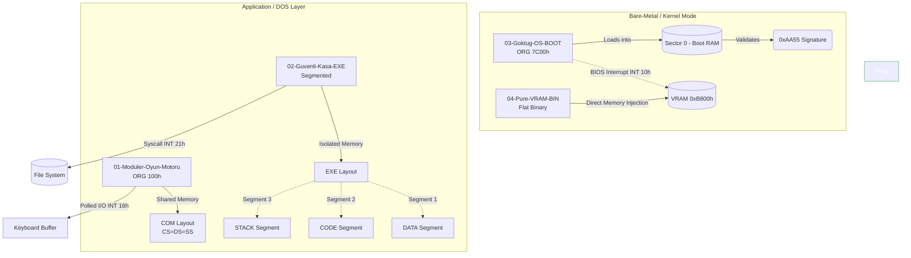

[](https://github.com/goktugcakiroglu/Low-Level-Universe/actions/workflows/assembly-ci.yml)

Low-Level-Universe, Intel 8086 mikroişlemci mimarisinin sınırlarını genişleten ve üst seviye dillerin soyutlama katmanlarından tamamen arındırılmış bir **düşük seviyeli sistem programlama** portfolyösüdür. Proje; modüler kod kütüphanelerinden (include mimarisi), kurumsal bellek yönetimine (EXE Çoklu Segmentasyonu), bilgisayarın ilk açılış saniyesini yöneten Bootloader tasarımlarından, doğrudan video belleğine (VRAM) erişim sağlayan Grafik Motorlarına kadar donanım-yazılım arayüzünün (Hardware-Software Interface) derinliklerini analiz eden 4 farklı katmandan oluşur.

**Not:** Bu proje, konvansiyonel ödev kalıplarına sıkışmış monolitik kod bloklarından oluşmaz. Tamamen **Modüler Programlama**, **Bellek Segmentasyonu İzolasyonu** ve **Direct Memory-Mapped I/O** prensipleriyle tasarlanmış; donanım kayıtçılarının (registers), yığın alanlarının (stack) ve kesme vektörlerinin (interrupts) yazılımcı tarafından doğrudan yönetildiği kurumsal bir alt seviye yazılım ekosistemidir.

## 🏗️ Execution Layers & Memory Architecture

Aşağıdaki mimari şema, projelerin işlemci (CPU) ve Fiziksel Bellek (RAM) üzerinde hangi güvenlik halkasında (Ring) çalıştığını ve donanımı nasıl kontrol ettiğini göstermektedir.



## Requirements

Projeleri simüle etmek, derlemek ve donanım çıktılarını gözlemlemek için aşağıdaki ortam gereksinimlerine ihtiyaç vardır:
* **Operating System:** Windows / Linux / macOS (Emülatör veya DOSBox katmanıyla çapraz platform uyumlu)
* **Development & Simulation Environment:** EMU8086 Microprocessor Emulator (v4.08+) veya yerel NASM/MASM derleyicileri ile yapılandırılmış DOSBox altyapısı.

## Build & Run

1. Projeyi yerel bilgisayarınıza klonlayın veya indirin.
2. **01-Moduler-Oyun-Motoru için:** EMU8086 emülatörünü açın, `01-Moduler-Oyun-Motoru/main.asm` dosyasını yükleyin. Üst menüden `Emulate` butonuna basın. Derleyici yan yana duran tüm `.inc` kütüphanelerini otomatik olarak tek gövdede birleştirecektir. `Run` dediğinizde asenkron oyun motoru ateşlenecektir.
3. **02-Guvenli-Kasa-EXE için:** `secure_vault.asm` dosyasını açıp derlediğinizde çoklu segmentli `.exe` şablonunun çalıştığını göreceksiniz.
4. **03-Goktug-OS-BOOT için:** `goktug_os.asm` dosyasını açıp emüle ettiğinizde, emülatör otomatik olarak sanal bir Floppy Disk (Disket) sürücüsü oluşturacak ve sistemi sıfırdan bu disketten boot edecektir.
5. **04-Pure-VRAM-BIN için:** `vram_filler.asm` dosyasını çalıştırıp ekran kartı hafızasının donanım seviyesinde nasıl manipüle edildiğini izleyin.

## How It Works (The Pipeline)

Sistemlerin donanım üzerinde ayağa kalkma, belleği işleme ve alt segmentleri yönetme süreci 3 ana operasyonel aşamadan oluşur:

1. **Pass 1 — Template & Model Definition (Mimari Seçimi):** Derleyici kodun en başındaki direktifleri analiz eder. Eğer `ORG 100h` varsa tek bir 64KB hücreye sıkışacak `COM` modelini, `SEGMENT` tanımları varsa çoklu bellek bloklarına yayılacak `EXE` modelini, `ORG 7C00h` varsa doğrudan BIOS'un RAM'e haritalayacağı `BOOT MBR` sektör modelini işlemciye hazırlar.
2. **Pass 2 — Register Allocation & Stack Alignment (Yazmaç ve Yığın Yönetimi):** Program çalışma anına girdiğinde veri segmentinin (`DS`), kod segmentinin (`CS`) ve yığının (`SS`) adres sınırları donanıma bildirilir. Fonksiyonlar arası veri geçişlerinde veya donanım kesmelerine girilirken `PUSH` ve `POP` komutları kullanılarak işlemcinin anlık hafıza haritası (VRAM koordinatları, dosya işaretçileri) yığın üzerinde mutlak emniyete alınır.
3. **Pass 3 — Asynchronous Polling & Hardware I/O (Kesme ve Çevre Birim Yönetimi):** Sistem, işlemciyi donduran bloklayıcı fonksiyonlar yerine, klavye tampon belleğini (`Keyboard Buffer`) arka planda sürekli tarayan asenkron bir `Polling` (`INT 16h / AH=01h`) döngüsü işletir. Girdiler anlık yakalanırken, eş zamanlı olarak sabit disk kesmeleriyle (`INT 21h`) kalıcı veri günlüğü (`syslog.txt`) tutulur veya doğrudan donanım portlarına yazılır.

## Supported Low-Level Features (Architecture Hierarchy Matrix)

Low-Level Universe motorları, x86 mimarisinin karakteristik yapılarını şu şekilde saf donanımsal mantığa ve dosya şablonlarına çevirir:

| Mimari Tip / Uzantı | Segment Yapısı | Boyut Sınırı | İşletim Sistemi Bağımlılığı | Bellek & Donanım Hedefi |
| :--- | :--- | :--- | :--- | :--- |
| **01-Moduler COM** (`.com`) | Tek bir segment vardır. Kod, Veri ve Stack iç içedir. | En fazla **64 KB** ile sınırlıdır. | DOS / Windows NTVDM katmanına bağımlıdır. | Sanal register takibi ve oyun döngüsü optimizasyonu. |
| **02-Segmented EXE** (`.exe`) | `DATA`, `CODE` ve `STACK` segmentleri tamamen ayrıdır. | Her bir segment ayrı ayrı 64 KB olabilir (**Megabaytlarca veri**). | DOS / İşletim sistemi API'si şarttır. | Büyük veritabanı blokları, string kıyaslama (`CMPSB`) ve bellek içi kriptografi. |
| **03-Bare-Metal BOOT** (`.bin/img`) | BIOS kurallarına tabidir. `ORG 7C00h` ile RAM'e haritalanır. | Tam olarak **512 Byte** olmak zorundadır. | **SIFIR BAĞIMLILIK**. İşletim sistemi yoktur, sistemin kendisidir. | Saf donanım kontrolü, doğrudan BIOS kesmeleri (`INT 10h`) ve donanımsal MBR imza doğrulaması (`0xAA55`). |
| **04-Pure BIN** (`.bin`) | Segment veya başlık (header) yoktur. Salt makine kodudur. | Sınır yoktur, ham ikilik dosyadır. | İşletim sistemi desteği yoktur, işlemci doğrudan okur. | **Memory-Mapped I/O**. Doğrudan ekran kartının metin modu hafıza adresine (`0xB800h`) sızma ve VRAM'i boyama. |

## Hardware Interfacing & Boundary Management

Sistem, çalışma anında donanımın çökmesini, bellek taşmalarını veya register bozulmalarını engellemek için alt seviye hata yakalama ve sınır kontrol mekanizmalarına sahiptir.

| Sınır / Risk Tipi | Tetiklenme Koşulu | Donanımsal / Mimari Çözüm |
| :--- | :--- | :--- |
| **VRAM Segment Drift** | Ekran hafızasına (`0xB800h`) yazarken koordinatların veya ofsetin ekran sınırını aşması. | Toplam ekran hücresi boyutu olan 2000 karakter sınırında `LOOP` sayacının otomatik kırılması ve işlemcinin dondurulması. |
| **Stack Corruption** | BIOS/DOS kesmelerine (`INT`) girerken veya fonksiyon çağırırken koordinat yazmaçlarının (`DX`) ezilmesi. | Kesme çağrılmadan hemen önce verinin `PUSH DX` ile yığına saklanması, kesme çıkışında `POP DX` ile bellek emniyetinin sağlanması. |
| **File Descriptor Leak** | Runtime esnasında skoru diske (`syslog.txt`) yazarken yarıda kesilme veya handle kaybı yaşanması. | `INT 21h / AH=3Ch` ile alınan dosya handle numarasının anında `BX` yazmacına kilitlenmesi ve işlemin `AH=3Eh` ile donanımsal kapatılması. |
| **Invalid Boot Signature** | BIOS'un açılış sektörünü (Sector 0) okuduğunda geçerli bir işletim sistemi çekirdeği bulamaması. | Kodun tam olarak 510. byte'ına `ORG 7DFEh` komutuyla erişilmesi ve son iki byte'a önyükleme imzası olan `0xAA55h` verisinin kaydedilmesi. |

## Project Structure

```text
Low-Level-Universe/
├── README.md                          # Main project documentation (This file)
│
├── 📁 01-Moduler-Oyun-Motoru/        # Modular COM Engine (Include Architecture)
│   ├── main.asm                      # Main orchestrator & asynchronous game loop
│   ├── core_macros.inc               # Metaprogramming macros for hardware routines
│   ├── core_mem.inc                  # String instructions (MOVSB/SCASB) for memory blocks
│   ├── core_gfx.inc                  # Video attribute management & hardware cursor masking
│   ├── core_file.inc                 # Interrupt-driven robust file streaming (LSEEK)
│   ├── core_video.inc                # Frame clearing and hardware coordinate translation
│   └── core_logger.inc               # Direct disk logging subroutine for live scores
│
├── 📁 02-Guvenli-Kasa-EXE/           # Large Memory Model (EXE Architecture)
│   └── secure_vault.asm              # Multi-segment layout isolating DATA, CODE, and STACK
│
├── 📁 03-Goktug-OS-BOOT/             # Operating System Kernel Layer (Boot Sector)
│   └── goktug_os.asm                 # Bare-metal kernel loaded at 0x7C00 with 0xAA55 signature
│
└── 📁 04-Pure-VRAM-BIN/              # Direct Hardware Manipulation Layer (Flat Binary)
    └── vram_filler.asm               # Non-OS hardware injection writing directly to VRAM 0xB800
```
